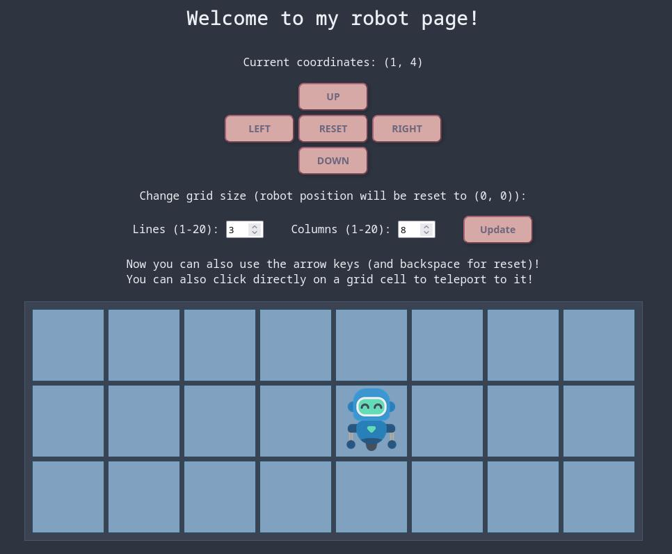

# 🦀🤖 *Rust*bot project



## 🌐 Where can I see what it does?

On my website here: [rustbot.clembytes.fr](https://rustbot.clembytes.fr)

## ✍️ Where can I follow the process

On my blog here: [clembytes](https://clembytes.fr/)

And more specifically the following articles: [clembytes.fr/category/rustbot](https://clembytes.fr/category/rusbot/)

## 💡 The idea

Move a little robot! This started as a way to practice basic programming concepts, but now I'm taking it further in Rust. The goal is to explore Rust's features while keeping the project fun and interactive.

*(This project is a Rust rewrite of my original [C version](https://github.com/ClemBytes/robot) of the robot.)*

## 📁 Project structure

- `src/main.rs` - Server program file
- `static/` - Static files (CSS, robot PNG image…)
- `templates/template.html` - HTML file
- `Cargo.toml`, `Cargo.lock` - Cargo config files

## ⚙️ Build & run

🧪 Build & run project in debug mode:
```sh
cargo run
```

🚀 Build & run project in release mode:
```sh
cargo run --release
```

Then see `0.0.0.0:3000`.

## 💌 Support

You can contact me about this project or my work at <clembytes@proton.me>.

## 🗺️ Roadmap

Here is what I plan to do in the future on this project:
- Add tests
- Work on CI/CD
- Add possibility to write a small list of instructions to follow
- Add walls, maybe some pathfindind?

## 📈 Project status

Ongoing work!